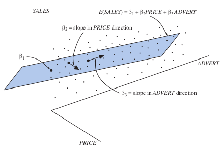

# 多元回归模型
Big Andy汉堡店需要评估价格策略和广告支出对销售的影响（数据集：andy.dat）。经济模型为：
$$SALES=\beta_1+\beta_2PRICE+\beta_3ADVERT$$
由于城市大小对销售额影响很大，我们只选择小城市作为样本。$PRICE$可采用某个价格指数。相应的计量模型为：
$$SALES=E(SALES)+e=\beta_1+\beta_2PRICE+\beta_3ADVERT+e$$
其中，系统部分是一个平面，称为回归平面。

一般的多元线性回归模型为：
$$y=\beta_1+\beta_2x_2+\beta_3x_3+\cdots+\beta_Kx_K+e$$
相应的，本例模型可以改写为：
$$y=\beta_1+\beta_2x_2+\beta_3x_3+e$$
我们作如下假设：

1. $E(e)=0$
2. $\mathrm{var}(e)=\sigma^2$
3. $\mathrm{cov}(e_i,e_j)=0$
4. $e\sim N(0,\sigma^2)$

从而，被解释变量具有性质：

1. $E(y)=\beta_1+\beta_2x_2+\beta_3x_3$
2. $\mathrm{var}(y)=\mathrm{var}(e)=\sigma^2$
3. $\mathrm{cov}(y_i,y_j)=\mathrm{cov}(e_i,e_j)=0$
4. $y\sim N[(\beta_1+\beta_2x_2+\beta_3x_3),\sigma^2]$